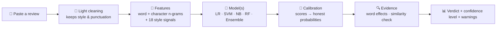
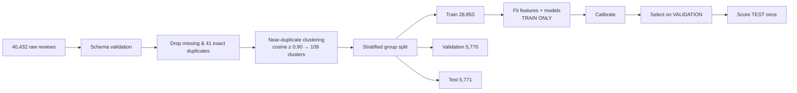
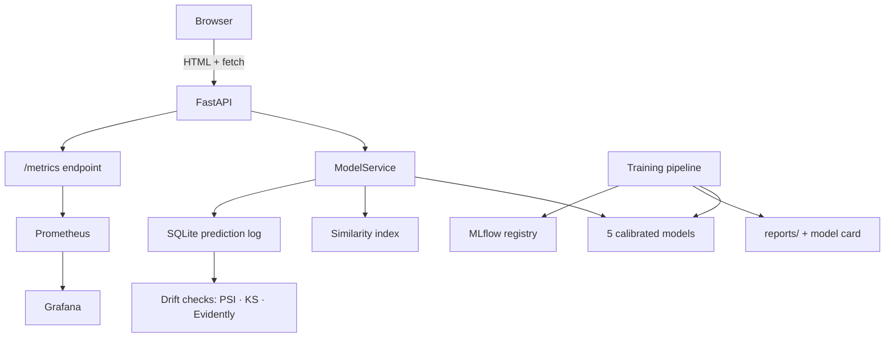

<div align="center">

# 🛡️ Veritas — Fake Review Intelligence

### *Not just "fake or real?" — but **how sure, why, and when not to trust the answer.***

`Python` · `scikit-learn` · `FastAPI` · `MLflow` · `DVC` · `Docker` · `GitHub Actions` · `Prometheus + Grafana` · `Evidently`

</div>

---

## ✨ What makes this different

Most "fake review detectors" are a single model that prints `FAKE (99.9%)`. Veritas is built around the opposite idea:
**a prediction is only useful if it is honest about its own uncertainty.**

| Typical project | Veritas |
|---|---|
| One model, one verdict | **5 models** you can pick, or **compare side by side** with a consensus meter |
| Raw scores shown as "confidence" | **Calibrated probabilities** (Platt scaling) with HIGH / MEDIUM / LOW levels |
| "Short review = fake", "many `!!!` = fake" rules | **Zero hand-written rules.** Everything is learned from labelled data (old rule layer was deleted) |
| Random train/test split | **Leakage-safe**: duplicates removed, near-duplicate clusters kept on one side of the split, asserted in code |
| Accuracy only | Precision / Recall / F1 for the **fake class**, ROC-AUC, PR-AUC, Brier, ECE, confusion matrices |
| Hides its mistakes | **Error analysis page** + automated **robustness tests** that expose weaknesses (see [Honest findings](#-honest-findings-what-the-tests-revealed)) |
| Hard-coded README numbers | **Every metric is generated** by the training run; nothing is typed in by hand |

---

## 🎬 How it works (60 seconds)



1. **Cleaning is deliberately light.** HTML and whitespace are removed, but capitalisation, punctuation, repeated letters and emoji are *kept* — they are legitimate style clues.
2. **Features** — TF-IDF over words (1–2-grams) and characters (2–5-grams) plus 18 stylistic/sentiment features. These are *inputs the model weighs*, never thresholds.
3. **Models** read the writing and output a probability.
4. **Calibration** corrects the score so "80 %" really means ≈ 80 % on unseen data.
5. **Evidence**: each word is removed in turn and the *deployed model is asked again*; the change in P(fake) is that word's contribution — so explanations are faithful to the model, never invented. A TF-IDF similarity layer flags near-copies of known reviews (a supporting signal that **never** changes the label).

> Output language is intentionally careful: **"Model prediction: FAKE"**, never "this review is fake".

---

## 🧭 Which model should I pick? (built into the UI)

Most people don't know what "Naive Bayes" is — so the app doesn't ask them to. The **Analyze** page shows plain-English cards with each model's *measured* accuracy and speed:

| Choice | In plain words | When to use it |
|---|---|---|
| ⭐ **Auto** *(recommended)* | Runs the model that scored best on validation data it never trained on | If you're unsure — always safe |
| 🔀 **Compare all** | Runs every model and shows how many agree | Borderline results. **If the models disagree, the review is genuinely hard to call** |
| **Word scoreboard** (Logistic Regression) | Weights every word and adds them up | Transparent, everyday use |
| **Sharpest boundary** (Linear SVM) | Finds the cleanest dividing line between genuine and fake writing | Highest accuracy of the simple models |
| **Quick counter** (Naive Bayes) | Compares word frequencies in fake vs genuine | Fast rough screening |
| **Panel of trees** (Random Forest) | Hundreds of small decision trees vote | A second opinion that thinks differently |
| **Team vote** (Ensemble) | Averages LR + SVM + NB | Steadier on borderline cases |

The default is chosen **on the validation split, not the test set**, so the test numbers stay unbiased.

---

## 📊 Real results

Held-out **test set: 5,771 reviews** never seen during training or model selection. "Fake" is the positive class. These numbers are copied from `reports/model_comparison.csv`, generated by the training run.

| Model | Accuracy | Precision | Recall | **F1** | ROC-AUC | PR-AUC | ms / review |
|---|---|---|---|---|---|---|---|
| **Linear SVM + TF-IDF** ⭐ default | 0.957 | 0.949 | 0.967 | **0.958** | 0.991 | 0.991 | 0.4 |
| Logistic Regression + TF-IDF | 0.954 | 0.944 | 0.965 | 0.954 | 0.990 | 0.990 | 0.3 |
| Soft-voting Ensemble (LR+SVM+NB) | 0.954 | 0.944 | 0.964 | 0.954 | 0.990 | 0.990 | 0.9 |
| Random Forest | 0.928 | 0.924 | 0.932 | 0.928 | 0.980 | 0.982 | 1.4 |
| Naive Bayes + TF-IDF | 0.906 | 0.895 | 0.919 | 0.907 | 0.965 | 0.967 | 0.2 |

**Why the SVM?** It had the best validation F1 (0.9595). The ensemble was tested on the same data and did **not** improve on it, so it was not promoted — an ensemble is only shipped if measurement says it helps.

**Confusion matrix (SVM, test):** 2,737 genuine correctly passed · **151 genuine wrongly flagged FAKE** (false positives) · **95 fakes missed** (false negatives) · 2,788 fakes caught.

**Calibration (SVM):** Brier 0.0345, ECE 0.0165 — when it says 90 %, it is right about 90 % of the time. Average confidence when correct: 95.0 %; when wrong: 72.8 % (errors are typically less confident, which is what you want).

**Errors depend heavily on length:**

| Words | Reviews | Error rate |
|---|---|---|
| 6–15 | 557 | 16.3 % |
| 16–40 | 2,394 | 5.5 % |
| 41–100 | 1,595 | 1.3 % |
| > 100 | 1,223 | 0.16 % |

---

## 🔬 Honest findings (what the tests revealed)

A project that only reports good news isn't engineering. Running the robustness suite (`python -m src.evaluation.robustness`) showed:

- **Every very short review ("Good.", "Nice.", "Works well.") is predicted FAKE.** The training data contains essentially no reviews under 5 words in either class (0 genuine, 3 fake), so the models extrapolate from nothing — an artefact of the dataset, not knowledge. The app therefore marks reviews shorter than the 1st percentile of training lengths as **out-of-support → LOW confidence with an explicit warning**. No length rule decides a label; the fix for real is labelled short genuine reviews.
- An enthusiastic "Absolutely amazing!!! Best product ever!!! Buy this now!!!" is predicted **GENUINE** — the model is *not* using "positive tone = fake".
- **Scope:** the dataset's "fake" class is *computer-generated* text vs *original* human reviews. The system is **not validated on paid human fake reviews**, other languages or other domains.
- Class balance is 50/50; real-world fake prevalence is lower, so absolute probabilities need re-calibration before production use.

---

## 🧱 Data pipeline & leakage prevention



- Conflicting-label duplicates are dropped; train/val/test share **no exact duplicates and no near-duplicate clusters** (enforced by assertions).
- TF-IDF and scalers are fitted on the training split only, inside sklearn pipelines.
- `data/TestReviews.csv` (restaurant reviews, undocumented label meaning) is deliberately **not** used for training.

---

## 🖥️ The web app

One page, no build step, served by the API at **http://localhost:8000**:

| Tab | What you get |
|---|---|
| **Analyze** | How-it-works walkthrough, model picker, review box with live word/sentence counts, demo examples (text only — results are always live), animated confidence gauge, probability bars, consensus meter, word-effect bars, review statistics, similarity analysis |
| **Batch** | Upload a CSV, pick the review column, analyze up to 5,000 rows, download results with prediction / confidence / level / model / sentiment / similarity |
| **Models** | The scoreboard above, confusion matrices, calibration numbers, error analysis with real false-positive / false-negative examples |
| **Monitor** | Drift status (PSI + KS tests), prediction counts, low-confidence rate, latency |

Dark / light themes, responsive layout, subtle animation.

---

## 🔌 API

| Endpoint | Purpose |
|---|---|
| `POST /predict` | One review → label, calibrated confidence, level, probabilities, explanation, similarity, stats. Optional `"model": "<key>"` |
| `POST /predict/compare` | Verdict of every model side by side |
| `POST /predict/batch` | Up to 2,000 reviews per call |
| `POST /explain/lime` | LIME explanation |
| `GET /models` · `/model-info` · `/performance` | Models + plain-English guide, selected model, full evaluation report |
| `GET /analytics` · `/monitoring/drift` | Dashboard data and drift status |
| `GET /health` · `/version` · `/metrics` | Health, versions, Prometheus metrics |
| `GET /docs` | Interactive Swagger UI |

```json
{
  "prediction": "GENUINE", "confidence": 0.895, "confidence_level": "HIGH",
  "probabilities": {"GENUINE": 0.895, "FAKE": 0.105},
  "model": "Linear SVM + TF-IDF", "processing_time_ms": 51,
  "explanation": ["Wording that pushed the model toward GENUINE: 'halfway', 'leaked', 'older', 'blender'."],
  "similarity_warning": false, "in_training_support": true,
  "disclaimer": "Model prediction only - an automated estimate, not proof that a review is fraudulent."
}
```

Inputs are validated (empty, > 5,000 chars, bad JSON → `422`); unexpected errors return a generic `500` — stack traces stay in server logs.

---

## 🏗️ Architecture



---

## ⚙️ MLOps

| Concern | Implementation |
|---|---|
| Config | `configs/config.yaml` — nothing hard-coded |
| Data & pipeline versioning | DVC — `dvc.yaml` (train, robustness stages) |
| Experiment tracking & registry | MLflow — params, metrics, artifacts per model (`MLFLOW_TRACKING_URI` can point at DagsHub) |
| Containers | `Dockerfile`, `docker-compose.yml` (API + UI, MLflow, Prometheus, Grafana) |
| CI | GitHub Actions: smoke-train on a sample → run tests → build image |
| Retraining | Manual, reasoned `workflow_dispatch`; produces a candidate artifact for **human review** — drift never triggers blind retraining or deployment |
| Monitoring | Prediction log, PSI + KS input drift, prediction/confidence drift, low-confidence rate, Prometheus counters + latency histogram, Grafana dashboard, optional Evidently HTML report |
| Model card | Auto-generated in `reports/model_card.md` (intended / non-intended use, limitations, biases, failure cases) |

---

## 🧪 Testing

`python -m pytest -q` → **20 tests passing**, covering:

- **Unit:** text cleaning, style features, metrics, confidence levels, PSI, schema validation
- **Data:** missing columns, duplicates, label balance, no leakage between splits
- **ML:** artifacts exist, probabilities in [0, 1] and sum to 1, no NaN, latency bound, outputs not rule-driven, reported metrics never perfect/placeholder
- **API:** schema, validation errors, unusual inputs (emoji, HTML, control chars, 4,000 dots), batch, model selection, compare, UI served
- **Robustness (inspection, no forced labels):** simple, enthusiastic, negative, long, poorly-written, repeated and edge-case reviews → `reports/robustness.json`

---

## 🚀 Run it

```bash
git clone https://github.com/Gannina-SriMadhav/Fake-Review-Detection-System.git
cd Fake-Review-Detection-System
pip install -r requirements.txt
python -c "import nltk; nltk.download('vader_lexicon')"

python -m src.models.train             # ~8 min on CPU: trains, calibrates, compares, writes reports
python -m src.evaluation.robustness    # edge-case inspection
python -m pytest -q                    # tests
uvicorn app.main:app --port 8000       # → http://localhost:8000
```

Optional: `python -m src.models.train --cv` (grouped cross-validation), `python -m src.models.transformer` (DistilBERT benchmark), `mlflow ui --backend-store-uri sqlite:///mlflow.db`, `docker compose up --build`.

> Trained `.joblib` models are not stored in git (size) — run the training command once after cloning.

---

## 🗂️ Project structure

```
app/            FastAPI app: api/ (routes), services/ (model service), schemas/
frontend/       index.html — the whole web UI
src/            data/ preprocessing/ features/ models/ evaluation/ explainability/ monitoring/
configs/        config.yaml
models/         trained artifacts (generated) + metadata
reports/        evaluation.json, model_card.md, robustness.json, comparison CSV (generated)
monitoring/     Prometheus + Grafana provisioning
tests/          unit, data, ML, API tests
.github/        CI + controlled retraining workflows
legacy/         the original Flask prototype, kept for reference
```

---

## 🔭 Roadmap

- Collect **labelled short genuine reviews** to fix the short-review blind spot (highest priority).
- Evaluate on **human-written fake reviews** and other domains; re-calibrate for realistic fake prevalence.
- Run the DistilBERT benchmark on GPU and promote it only if it wins on validation.
- Add a human-in-the-loop review queue feeding the controlled retraining workflow.

---

<div align="center">

**⚠️ This system provides an automated prediction and should not be treated as definitive proof that a review is fraudulent.**

</div>
