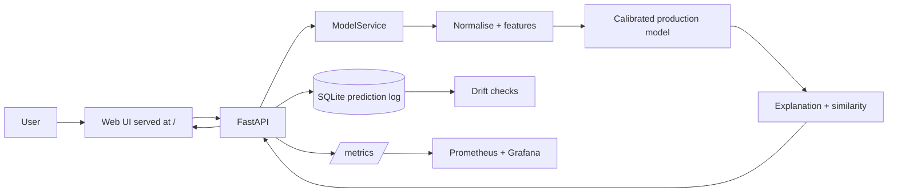
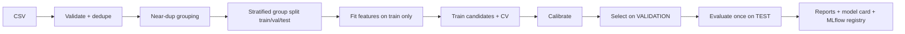

# Fake Review Intelligence

Fake-review detection: several calibrated ML models → FastAPI with a built-in single-page web UI, with MLflow/DVC/Docker/CI, monitoring and drift checks.
**No metric in this repository is hand-written.** Every number shown in the UI, model card and reports is generated by `python -m src.models.train`
(see `reports/`). Before a model is trained the UI says *"Not evaluated yet."*

> A prediction is an automated estimate ("Model prediction: FAKE"), **not proof** that a review is fraudulent.

## Problem statement & objectives
Classify a review as `GENUINE` or `FAKE` and — equally important — say *how sure* the model is, *why*, and when it should not be trusted.
- No hard-coded rules (length, "amazing", exclamation marks, sentiment…) ever decide a label; the model learns from labelled data.
  (The previous version contained a `SPAM_PHRASES` rule layer and an unrelated "fake news" fallback model; both were removed — old code is kept in `legacy/`.)
- Calibrated probabilities → HIGH / MEDIUM / LOW confidence, with explicit warnings for low confidence.
- Leakage-safe evaluation, class-specific metrics, error analysis, robustness testing, monitoring.

## Architecture

Training pipeline:


## Data pipeline & preprocessing
`src/data/loader.py`: schema validation, missing-value handling, exact-duplicate removal (conflicting-label duplicates dropped),
near-duplicate clustering (TF-IDF cosine ≥ 0.90), **stratified group split** so near-duplicates never straddle train/val/test, with assertions for
group and exact-duplicate leakage. Feature extractors are fit on the training split only, inside pipelines.
`src/preprocessing/cleaning.py` is deliberately light (Unicode NFKC, HTML/control-char removal, whitespace, URL token): punctuation, casing,
repeated characters and emoji are preserved because they are legitimate stylistic signals. Stop-words are kept for the same reason.

Dataset: `data/fake reviews dataset.csv` (`CG` = computer-generated → FAKE, `OR` = original → GENUINE). `data/TestReviews.csv` has undocumented label
semantics and a different domain (restaurants), so it is **not** used for training.

## Feature engineering
Word 1–2-gram TF-IDF, character 2–5-gram TF-IDF, and 18 style/sentiment features (word/char/sentence counts, lexical diversity, repetition,
punctuation / exclamation / uppercase / digit ratios, emoji & URL counts, VADER sentiment). These are inputs the model weights statistically —
never thresholds.

## Model comparison, selection & evaluation
Candidates (`configs/config.yaml`): Logistic Regression, Linear SVM, Complement Naive Bayes, Random Forest, Histogram Gradient Boosting,
and a soft-voting ensemble (only shipped if it wins). Small grids are tuned on the **validation** split; 3-fold grouped CV on train is reported;
the **production model is chosen by F1 of the FAKE class on validation**; the test split is scored once for reporting.
Metrics: accuracy, precision/recall/F1 (fake and genuine), ROC-AUC, PR-AUC, Brier, ECE, confusion matrix, FP/FN rates, inference time →
`reports/evaluation.json`, `reports/model_comparison.csv`.
A DistilBERT experiment is supported via `src/models/transformer.py` (disabled by default; CPU-expensive). It enters the comparison only if its
metrics file exists.

## Confidence calibration
Each classifier is wrapped in `CalibratedClassifierCV` (sigmoid/Platt by default; isotonic configurable). Confidence = calibrated probability of
the predicted class; HIGH ≥ 0.85, MEDIUM ≥ 0.70, else LOW (configurable). Brier score, ECE and reliability curves are in the Model Performance page.

## Explainability
Word-removal (occlusion) contributions computed from the *deployed model's own probabilities*, optional LIME (`/explain/lime`), plus a TF-IDF
similarity layer (exact / near-duplicate / similar) that is displayed as a supporting signal and never changes the label.

## Error analysis, robustness, model card
`reports/evaluation.json → error_analysis` (false positives/negatives, error by length, confidence of errors),
`python -m src.evaluation.robustness` → `reports/robustness.json` ("Model Robustness Testing": simple, enthusiastic, negative, long, poorly-written,
repeated and edge inputs — outputs inspected, no forced labels), `reports/model_card.md`.

## API
| Endpoint | Purpose |
|---|---|
| `POST /predict` | single review (optional `model` key) → label, calibrated confidence, level, probabilities, explanation, similarity, stats |
| `POST /predict/compare` | verdict of every model side by side |
| `GET /models` | available models |
| `POST /predict/batch` | up to 2000 reviews |
| `POST /explain/lime` | LIME explanation |
| `GET /health`, `/version`, `/model-info` | status, versions, selected model + test metrics |
| `GET /performance`, `/analytics`, `/monitoring/drift` | data for the dashboard pages |
| `GET /metrics` | Prometheus |

Validation: empty/oversized (5000 chars) input → 422; unexpected errors → generic 500 (stack traces only in server logs).

## Frontend
One plain HTML page (`frontend/index.html`, no build step) served by the API at `/`: Analyze (pick a model or *compare all*), Batch (CSV in/out), Models (comparison, confusion matrices, error analysis), Monitor (drift). Dark/light toggle. It only calls the API. Demo examples are text only; predictions are always live.

## MLOps & monitoring
- **DVC**: `dvc.yaml` (train, robustness stages). **MLflow**: params/metrics/artifacts per candidate, production model registered
  (`MLFLOW_TRACKING_URI` can point to DagsHub). **Docker / compose**: api, frontend, mlflow, prometheus, grafana.
- **CI** (`.github/workflows/ci.yml`): smoke-train on a sample, run tests, build Docker. **Retraining** (`retrain.yml`): manual, reasoned,
  produces a candidate artifact for human review — drift never triggers blind retraining.
- **Monitoring**: prediction log (SQLite), PSI + KS drift on input features, prediction/confidence drift, low-confidence rate, Prometheus counters
  and latency histogram, Grafana dashboard, optional Evidently HTML report (`src/monitoring/drift.py::evidently_html`).

## Run locally
```bash
pip install -r requirements.txt
python -m src.models.train            # train + evaluate + reports (use --sample 3000 for a quick run)
python -m src.evaluation.robustness   # robustness inspection
python -m pytest -q                   # tests
uvicorn app.main:app --port 8000      # API + web UI -> http://localhost:8000
mlflow ui --backend-store-uri sqlite:///mlflow.db
```
Docker: `docker compose up --build` (API + UI :8000, MLflow :5000, Prometheus :9090, Grafana :3000). Train first so `models/` exists.

**Known limitation (measured):** the training data has almost no reviews under ~5 words, and every very short review ("Good.", "Nice.") is predicted FAKE by the models - a dataset artifact, not knowledge. The app flags such inputs as out-of-support / LOW confidence. See `python -m src.evaluation.robustness`.

## Project structure
```
app/ (api, services, schemas, main.py)   frontend/index.html   src/ (data, preprocessing, features, models, evaluation, explainability, monitoring)
configs/config.yaml   models/   reports/   monitoring/   tests/   notebooks/   .github/workflows/   dvc.yaml   Dockerfile   docker-compose.yml   legacy/
```

## Limitations
See `reports/model_card.md` (generated). Key points: labels are computer-generated vs original reviews, not verified paid human fakes;
class balance is 50/50 so absolute probabilities need recalibration for production prevalence; very short reviews carry little evidence.
